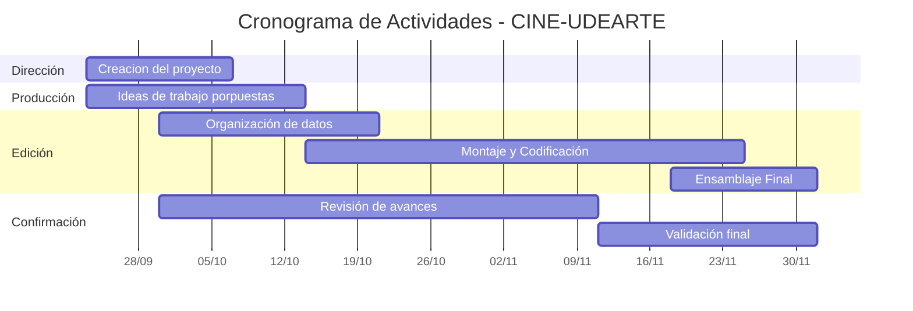

# CINE-UDEARTE

Un espacio para explorar el cine como arte, como lenguaje, y como herramienta de transformación social.

## 👥 1. Integrantes  

- **Jonhy Ochoa Correa** – Mi rol en el grupo sera el de guiar y apoyar a mis compañeros para
  lograr el mejor resultado en el desarrollo de este gran proyecto del cinema.  
- **Josuar Loaiza Londoño** – Coordinar y combinar las habilidades y esfuerzos del equipo para transformar ideas en resultados    o metas concretas de manera eficiente y efectiva.  
- **Nicoll Pamela Rosero Enriquez**– Mi rol en el grupo será el de edición, encargándome de organizar, revisar y mejorar la        presentación del proyecto, corrigiendo detalles y asegurando que el trabajo final tenga claridad.  
- **Mariam Pertuz Otero** – Mi rol en el grupo sera el confirmar y rectificar que todo lo hecho este bien despues de que todos    hayamos aportado y estemos de acuerdo con lo hecho.  

---

## 🎓 2. Vínculos Académicos y Descripción  

### 👤 Jonhy Ochoa Correa  
- **Programa:** Ingenieria Indsutrial virtual - Sede el Carmen de Viboral  
- **Habilidades y fortalezas:** Apoyo en cuanto las dudas generadas, me gusta meterme en el cuento del trabajo
  y poder aportar el mayor conocimiento posible a la resolución de cada aspecto.  

### 👤 Josuar Loaiza Londoño 
- **Programa:** Ingenieria Industrial virtual - Sede Segovia 
- **Habilidades y fortalezas:** Disposición en cuanto a la planeación y control de la información planteada. Me identifico
  por mi buena comprensión respecto a las opiniones dispuestas por mi equipo y por buscar la manera de mejorarlas o llevarlas
  a cabo.  

### 👤 Nicoll Pamela Rosero Enriquez  
- **Programa:** Ingenieria Industrial virtual - Sede Medellin  
- **Habilidades y fortalezas:** Soy alguien que se fija mucho en las cosas pequeñas y eso me ayuda a darme cuenta de detalles que a veces pasan desapercibidos ademas me gusta analizar bien las situaciones ,porque siento que así se evita errores y se encuentran mejores soluciones.  Ademas soy una persona con muy buena disposición para trabajar en equipo .
### 👤 Mariam Pertuz Otero   
- **Programa:** Ingenieria Industrial virtual - Sede Caucasia  
- **Habilidades y fortalezas:** Me considero buena trabajando en equipo, comunicando, escuchando a mis compañeros y colaborando. Me adapto con facilidad soy responsable y organizada.

---

## 🏷️ 3. Nombre del Proyecto y Detalles  

**Nombre del Proyecto:** CINE-UDEARTE

**Descripción en pocas líneas:**  
Este proyecto busca crear un programa funcional y optimo para poder entrar al cinema, poder hacer reservas de sillas,
escoger la pelicula de su preferencia con el dia y la hora que mas se acomode a su tiempo.

---

## 🔒 4. Licencia del Software  

Este proyecto se distribuye bajo la licencia **MIT License**, lo que significa que:  

- El software puede ser usado, copiado, modificado y distribuido libremente.  
- Se debe incluir siempre una copia de esta licencia en cualquier distribución del proyecto.  
- El software se proporciona **“tal cual”**, sin garantías de ningún tipo.  

📌 La elección de esta licencia busca fomentar la **colaboración, aprendizaje y reutilización académica**, manteniendo la libertad de uso para la comunidad universitaria.  

<a href="https://github.com/JonhyOC/CINE-UDEARTE/edit/main/README.md">CINE-UDEARTE</a> © 2025 by <a href="https://github.com/JonhyOC/CINE-UDEARTE/edit/main/README.md">Jonhy Ochoa Correa, Nicoll Pamela Rosero Enriquez, Josuar Loaiza Londoño, Mariam Pertuz Otero</a> is licensed under <a href="https://creativecommons.org/licenses/by-nc/4.0/">Creative Commons Attribution-NonCommercial 4.0 International</a>

## 🌟 5. Reporte de Visión  

El software de apoyo a este proyecto permitirá organizar y gestionar las entradas a las diferentes peliculas 
con tarifas diferenciales para cada publico y horarios accesibles.
Su objetivo es **centralizar la información, asignar sillas de acuerdo a la preferencia de cada usuario**, aportando beneficios como:  
- Horarios que se ajustan a los tiempos de cada persona.
- Variedad de peliculas para todos.
- Amplio espacio para escoger el lugar que mas se ajuste a la preferencia del cliente.  

---

## 📋 6. Especificación de Requisitos  

### ✅ Requisitos Funcionales  
1. Registro de sillas disponibles segun pelicula, dia y horario.  
2. Gestión efectiva de las entradas.  
3. Rápida respuesta para que el usuario pueda escoger su asiento de manera ágil y sencilla.  
4. Expriencia funcional optima con una interfaz dinamica y llamativa.  

### ⚙️ Requisitos No Funcionales  
1. **Usabilidad:** Interfaz sencilla e intuitiva.
   El sistema está diseñado con una **interfaz de consola sencilla e intuitiva**, orientada a facilitar la interacción del usuario.  
   - Los menús presentan **opciones numeradas** claramente identificadas (Registrar Usuario, Reservar Asiento, Cancelar, etc.).  
   - Las instrucciones se muestran en lenguaje claro y ordenado, sin necesidad de conocimientos técnicos previos.  
   - Los mensajes del sistema orientan al usuario en cada paso, reduciendo errores durante el proceso de reserva.  
   - Se prioriza la **legibilidad del texto**, utilizando espacios, líneas y separadores para guiar visualmente la navegación.
      
2. **Rendimiento:** Respuesta rápida al cargar y actualizar la disponibilidad de sillas.
   El programa ofrece una **respuesta inmediata** al ejecutar acciones como cargar el estado de las sillas, registrar usuarios o confirmar reservas. 
   - La matriz de 121 asientos se actualiza dinámicamente en tiempo real.  
   - Las operaciones principales (registro, consulta, cancelación) se ejecutan en **menos de un segundo** en un entorno de consola estándar.  
   - El código está optimizado para manejar múltiples usuarios y operaciones consecutivas sin afectar la velocidad de ejecución.
      
3. **Compatibilidad:** Accesible desde navegadores comunes.
   El sistema es **totalmente portable** y puede ejecutarse desde cualquier entorno compatible con Python.  
   - Funciona en **Windows, macOS y Linux**, sin necesidad de instalación adicional.  
   - Es accesible desde terminales de línea de comandos y entornos de desarrollo integrados (VS Code, PyCharm, etc.).  
   - Permite la integración con navegadores o herramientas externas en versiones futuras (por ejemplo, para visualización web o informes).
        
4. **Seguridad:** Libre acceso para todo tipo de usuarios garantizando su reserva a la hora de confirmar su elección.
   Aunque el sistema permite un **acceso libre a los menús principales**, se garantiza la seguridad de las reservas y la información del usuario        mediante:  
   - Confirmación obligatoria antes de registrar o cancelar una reserva.  
   - Validación de datos al ingresar identificaciones o tipos de usuario.  
   - Evita duplicaciones o sobreescrituras de asientos ya ocupados.  
   - Los datos almacenados (usuarios, reservas, facturas) pueden guardarse en archivos protegidos o de solo lectura según el rol del operador.  
 
5. **Fiabilidad:** Disponibilidad estable en cualquier hora del dia.
   El sistema garantiza una **disponibilidad continua y estable** durante cualquier hora del día, siempre que el programa esté en ejecución.  
   - La gestión de reservas y asientos se mantiene coherente incluso tras múltiples operaciones.  
   - Los registros se actualizan y guardan automáticamente, evitando pérdidas en caso de cierres inesperados.  
   - Permite la recuperación del estado del cinema desde archivos guardados para continuar las operaciones sin interrupciones.  

---

## 📅 7. Plan de Proyecto  

### 🎬 Cronograma y Presupuesto del Proyecto de Cinema Universitario  

**Fecha de inicio del semestre:** 12 de agosto de 2025  
**Periodo de trabajo:** Semana 7 a semana 16  

---

## 📋 Actividades por Estudiante  

- **Dirección: Jonhy Ochoa Correa**   
- **Producción: Josuar Loaiza**  
- **Edición: Nicoll Rosero** 
- **Confirmación: Mariam Pertuz** 

---

## 📅 Tabla de Actividades Semanales  

| Semana | Fechas aproximadas | 
|--------|-------------------|
| 7 | 23 - 29 sept. | 
| 8 | 30 sept. - 6 oct. | 
| 9 | 7 - 13 oct. | 
| 10 | 14 - 20 oct. | 
| 11 | 21 - 27 oct. | 
| 12 | 28 oct. - 3 nov. |
| 13 | 4 - 10 nov. | 
| 14 | 11 - 17 nov. | 
| 15 | 18 - 24 nov. |
| 16 | 25 nov. - 1 dic. |

---

## 📅 Cronograma de Actividades (Diagrama de Gantt)  
 

💰 Presupuesto en horas de practica

Valor del SMLV (2025): $1,300,000 COP

Horas mensuales (jornada legal): 240 horas

Valor hora: $1,300,000 ÷ 240 = $5,417 COP/hora

Distribución por Estudiante
12.5 horas × $5,417 = $67,708 COP (equivalente en tiempo de práctica).

Total del Proyecto
50 horas × $5,417 = $270,833 COP (equivalente en tiempo de práctica).

📌 Nota: Este presupuesto no se paga en dinero, corresponde al valor académico de la práctica profesional del grupo.

---

## 🔢 8. Plan de Versionado

El control de versiones del proyecto se gestionará utilizando **Git y GitHub** como herramientas principales.  
Cada actualización del proyecto seguirá una estructura clara para mantener el orden y la trazabilidad de los cambios.  

### 🧾 Registro de Versiones  
| Versión | Fecha | Descripción | Responsable |
|----------|--------|-------------|--------------|
| v1.0.0 | 24/10/2025 | Versión inicial del proyecto | Jonhy Ochoa Correa |
| v1.1.0 | 27/10/2025 | Primera actualización con mejoras | Jonhy Ochoa Correa |
| v1.1.1 | 07/11/2025 | Actualizacion de los requisitos no funcionales del programa | Jonhy Ochoa Correa |
| v2.0.0 | 10/11/2025 | Creacion del Codigo y actualizacion | Jonhy Ochoa Correa |

📌 *El objetivo de este plan es garantizar que cada cambio quede documentado y sea fácilmente reversible si es necesario.*

### v1.1.0 Primera Actualizacion

El presente proyecto busca desarrollar un **programa de consola en Python** que permita la **gestión integral del Cinema Universitario UDEARTE**, ofreciendo una experiencia organizada para los usuarios y una administración eficiente del servicio cinematográfico.

---

### 🎯 Objetivo General  
Diseñar un sistema de gestión que permita registrar usuarios, gestionar reservas de asientos, generar cobros, imprimir facturas y consultar reportes administrativos del Cinema UDEARTE.

---

### 🧩 Funcionalidades Principales  

El programa contará con las siguientes opciones dentro de su menú principal:

1. **Registrar Usuario**  
   Permite el ingreso de nuevos usuarios al sistema, clasificándolos según su tipo:  
   - Estudiante  
   - Docente  
   - Administrativo  
   - Oficial Interno  
   - Público Externo  

2. **Registrar Reserva**  
   El usuario podrá seleccionar película y asiento disponible de una matriz de **121 sillas (11x11)**, representadas por letras    (A–K) y números (1–11).  
   - `'O'` indica asiento disponible  
   - `'X'` indica asiento ocupado  

3. **Cancelar Reserva**  
   Opción para eliminar una reserva previamente registrada y liberar el asiento correspondiente.

4. **Consultar Funciones del Fin de Semana**  
   Muestra las películas disponibles, su horario y clasificación.

5. **Generar Factura**  
   El sistema calculará el valor total de la reserva según el tipo de usuario y mostrará el detalle en una factura.

6. **Reporte Administrativo**  
   Opción para visualizar:
   - Total de ingresos generados  
   - Número de reservas activas y canceladas  
   - Estadísticas generales del servicio

7. **Salir del Sistema**  
   Cierra la aplicación.

---

### 💺 Estructura de Sillas  

El Cinema UDEARTE tiene una capacidad total de **121 asientos**.  
El sistema generará una matriz de 11 filas (A–K) y 11 columnas (1–11) que podrá verse en consola de la siguiente manera:

     1   2   3   4   5   6   7   8   9  10  11

    
A ['O', 'O', 'O', 'O', 'O', 'O', 'O', 'O', 'O', 'O', 'O']

B ['O', 'O', 'O', 'O', 'O', 'O', 'O', 'O', 'O', 'O', 'O']

C ['O', 'O', 'O', 'O', 'O', 'O', 'O', 'O', 'O', 'O', 'O']

D ['O', 'O', 'O', 'O', 'O', 'O', 'O', 'O', 'O', 'O', 'O']

E ['O', 'O', 'O', 'O', 'O', 'O', 'O', 'O', 'O', 'O', 'O']

F ['O', 'O', 'O', 'O', 'O', 'O', 'O', 'O', 'O', 'O', 'O']

G ['O', 'O', 'O', 'O', 'O', 'O', 'O', 'O', 'O', 'O', 'O']

H ['O', 'O', 'O', 'O', 'O', 'O', 'O', 'O', 'O', 'O', 'O']

I ['O', 'O', 'O', 'O', 'O', 'O', 'O', 'O', 'O', 'O', 'O']

J ['O', 'O', 'O', 'O', 'O', 'O', 'O', 'O', 'O', 'O', 'O']

K ['O', 'O', 'O', 'O', 'O', 'O', 'O', 'O', 'O', 'O', 'O']

### v1.1.1 Primera Actualización.

De acuerdo a las especificaciones y avances del programa los requisitos no funcionales han sido mejorados para ser mas
explícitos y claros, dando mayor objetividad en cuanto a usabilidad, rendimiento, compatibilidad, seguridad y fiabilidad.

### v2.0.0 Creación y actualizacion del código.

En ésta parte se empieza la implementacion del código que busca inicialmente capturar los datos del ususario. En las siguientes versiones el código será mas funcional dando la opcion al usuario de poder escoger su película favorita, asiento, fecha y hora 
en la que desea ver la función.
