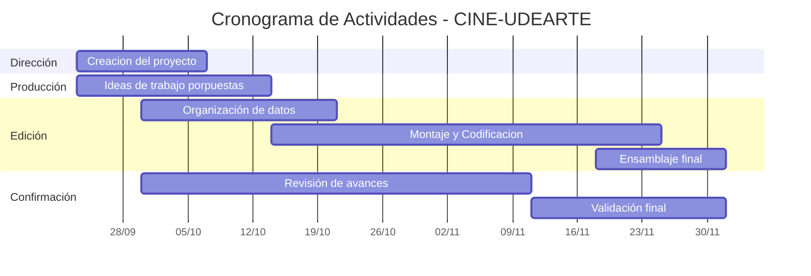

# CINE-UDEARTE

Un espacio para explorar el cine como arte, como lenguaje, y como herramienta de transformación social.

## 👥 1. Integrantes  

- **Jonhy Ochoa Correa** – Mi rol en el grupo sera el de guiar y apoyar a mis compañeros para
  lograr el mejor resultado en el desarrollo de este gran proyecto del cinema.  
- **Josuar Loaiza Londoño** – Coordinar y combinar las habilidades y esfuerzos del equipo para transformar ideas en resultados    o metas concretas de manera eficiente y efectiva.  
- **Nicoll Pamela Rosero Enriquez**– Mi rol en el grupo será el de edición, encargándome de organizar, revisar y mejorar la        presentación del proyecto, corrigiendo detalles y asegurando que el trabajo final tenga claridad.  
- **Mariam Pertuz Otero** – Mi rol en el grupo sera el confirmar y rectificar que todo lo hecho este bien despues de que todos    hayamos aportado y estemos de acuerdo con lo hecho.  

---

## 🎓 2. Vínculos Académicos y Descripción  

### 👤 Jonhy Ochoa Correa  
- **Programa:** Ingenieria Indsutrial virtual - Sede el Carmen de Viboral  
- **Habilidades y fortalezas:** Apoyo en cuanto las dudas generadas, me gusta meterme en el cuento del trabajo
  y poder aportar el mayor conocimiento posible a la resolucion de cada aspecto.  

### 👤 Josuar Loaiza Londoño 
- **Programa:** Ingenieria Industrial virtual - Sede Segovia 
- **Habilidades y fortalezas:** Disposición en cuanto a la planeación y control de la información planteada. Me identifico
  por mi buena comprensión respecto a las opiniones dispuestas por mi equipo y por buscar la manera de mejorarlas o llevarlas
  a cabo.  

### 👤 Nicoll Pamela Rosero Enriquez  
- **Programa:** Ingenieria Industrial virtual - Sede Medellin  
- **Habilidades y fortalezas:** Soy alguien que se fija mucho en las cosas pequeñas y eso me ayuda a darme cuenta de detalles que a veces pasan desapercibidos ademas me gusta analizar bien las situaciones ,porque siento que así se evita errores y se encuentran mejores soluciones.  Ademas soy una persona con muy buena disposicico para trabajar en equipo .
### 👤 Mariam Pertuz Otero   
- **Programa:** Ingenieria Industrial virtual - Sede Caucasia  
- **Habilidades y fortalezas:** Me concidero buena trabajando en equipo, comunicando, escuchando a mis compañeros y colaborando. Me adapto con facilidad soy responzable y organizada.

---

## 🏷️ 3. Nombre del Proyecto y Detalles  

**Nombre del Proyecto:** CINE-UDEARTE

**Descripción en pocas líneas:**  
Este proyecto busca crear un programa funcional y optimo para poder entrar al cinema, poder hacer reservas de sillas,
escoger la pelicula de su preferencia con el dia y la hora que mas se acomode a su tiempo.

---

## 🔒 4. Licencia del Software  

Este proyecto se distribuye bajo la licencia **MIT License**, lo que significa que:  

- El software puede ser usado, copiado, modificado y distribuido libremente.  
- Se debe incluir siempre una copia de esta licencia en cualquier distribución del proyecto.  
- El software se proporciona **“tal cual”**, sin garantías de ningún tipo.  

📌 La elección de esta licencia busca fomentar la **colaboración, aprendizaje y reutilización académica**, manteniendo la libertad de uso para la comunidad universitaria.  

    CINE - UDEARTE © 2025 por Jonhy Ochoa Correa, Nicoll Pamela Rosero Enriquez, Josuar Loaiza Londoño, Mariam Pertuz Otero tiene licencia CC BY-NC 4.0. Para ver una copia de esta licencia, visite https://creativecommons.org/licenses/by-nc/4.0/

## 🌟 5. Reporte de Visión  

El software de apoyo a este proyecto permitirá organizar y gestionar las entradas a las diferentes peliculas 
con tarifas diferenciales para cada publico y horarios accesibles.
Su objetivo es **centralizar la información, asignar sillas de acuerdo a la preferencia de cada usuario**, aportando beneficios como:  
- Horarios que se ajustan a los tiempos de cada persona.
- Variedad de peliculas para todos.
- Amplio espacio para escoger el lugar que mas se ajuste a la preferencia del cliente.  

---

## 📋 6. Especificación de Requisitos  

### ✅ Requisitos Funcionales  
1. Registro de sillas disponibles segun pelicula, dia y horario.  
2. Gestión efectiva de las entradas.  
3. Rapida respuesta para que el usuario pueda escoger su asiento de manera agil y sencilla.  
4. Expriencia funcional optima con una interfaz dinamica y llamativa.  

### ⚙️ Requisitos No Funcionales  
1. **Usabilidad:** Interfaz sencilla e intuitiva.  
2. **Rendimiento:** Respuesta rápida al cargar y actualizar la disponibilidad de sillas.  
3. **Compatibilidad:** Accesible desde navegadores comunes.  
4. **Seguridad:** Libre acceso para todo tipo de usuarios garantizando su reserva a la hora de confirmar su eleccion.  
5. **Fiabilidad:** Disponibilidad estable en cualquier hora del dia.  

---

## 📅 7. Plan de Proyecto  

### 🎬 Cronograma y Presupuesto del Proyecto de Cinema Universitario  

**Fecha de inicio del semestre:** 12 de agosto de 2025  
**Periodo de trabajo:** Semana 7 a semana 16  

---

## 📋 Actividades por Estudiante  

- **Dirección: Jonhy Ochoa Correa**   
- **Producción: Josuar Loaiza**  
- **Edición: Nicoll Rosero** 
- **Confirmación: Mariam Pertuz** 

---

## 📅 Tabla de Actividades Semanales  

| Semana | Fechas aproximadas | 
|--------|-------------------|
| 7 | 23 - 29 sept. | 
| 8 | 30 sept. - 6 oct. | 
| 9 | 7 - 13 oct. | 
| 10 | 14 - 20 oct. | 
| 11 | 21 - 27 oct. | 
| 12 | 28 oct. - 3 nov. |
| 13 | 4 - 10 nov. | 
| 14 | 11 - 17 nov. | 
| 15 | 18 - 24 nov. |
| 16 | 25 nov. - 1 dic. |

---

## 📅 Cronograma de Actividades (Diagrama de Gantt)  
 

```mermaid
gantt
    title Cronograma de Actividades - CINE-UDEARTE
    dateFormat  YYYY-MM-DD
    axisFormat  %d/%m

    section Dirección
    Creacion del proyecto             :dir1, 2025-09-23, 2w
    

    section Producción
    Ideas de trabajo porpuestas       :prod1, 2025-09-23, 3w
    
    section Edición
    Organización de datos             :edit1, 2025-09-30, 3w
    Montaje y Codificacion            :edit2, 2025-10-14, 6w
    Ensamblaje final                  :edit3, 2025-11-18, 2w

    section Confirmación
    Revisión de avances               :conf1, 2025-09-30, 6w
    Validación final                  :conf2, 2025-11-11, 3w
```

💰 Presupuesto en horas de practica

Valor del SMLV (2025): $1,300,000 COP

Horas mensuales (jornada legal): 240 horas

Valor hora: $1,300,000 ÷ 240 = $5,417 COP/hora

Distribución por Estudiante
12.5 horas × $5,417 = $67,708 COP (equivalente en tiempo de práctica).

Total del Proyecto
50 horas × $5,417 = $270,833 COP (equivalente en tiempo de práctica).

📌 Nota: Este presupuesto no se paga en dinero, corresponde al valor académico de la práctica profesional del grupo.
